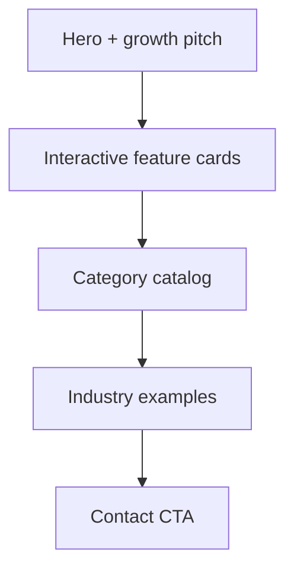

# Capabilities Page (`/capabilities`)

## Decisions locked
- Route: **`/capabilities`**, title **Platform Features** / **Capabilities**
- Main nav: add **Capabilities** (between Services and Process in [`src/lib/site.ts`](src/lib/site.ts))
- V1: full interactive cards + screenshot **placeholder slots** (no real images required yet)
- Internal roadmap: markdown file in repo, **not** routed or linked publicly

## Page structure

1. **Hero** — “Start simple. Grow over time.” plus short supporting copy (your growth message).
2. **Featured platform cards** — interactive grid of the nine highlights (Online Scheduling, Customer Login, AI Assistant, Parent Portal, Online Payments, Mobile App Ready, Email Automation, Analytics Dashboard, Admin Portal). Click expands: what it does, who it’s for, which plans include it, and a screenshot slot.
3. **Capabilities by category** — full lists under Website Foundation, Scheduling & Booking, Payments, Customer Portals, Admin Tools, AI & Automation (from your outline).
4. **Industry examples** — short “built for” list (gyms, salons, golf, advisors, medical, contractors, restaurants, real estate, nonprofits) — tags/examples only, not separate industry pages.
5. **CTA** — link to `/contact` and `/pricing`.

## Data model

New [`src/data/capabilities.ts`](src/data/capabilities.ts):

- `capabilityCategories[]` — `{ id, name, items: string[] }` for the catalog
- `featuredFeatures[]` — for interactive cards:
  - `id`, `title`, `summary`
  - `whatItDoes`, `whoItsFor`
  - `plans: ("personal-brand" | "launch" | "growth" | "outright" | "custom" | "addon")[]`
  - `screenshot?: { src: string; alt: string }` — omit = show placeholder panel (“Screenshot coming soon”)
- `industryExamples: string[]`
- `capabilitiesHero` + growth copy constants

Plan labels map to existing pricing names (Personal Brand, Launch Website, Growth Website, Purchase Outright, Custom Software, Add-on).

## UI components

- [`src/components/FeatureCardGrid.tsx`](src/components/FeatureCardGrid.tsx) (client) — card grid; one expanded at a time (same accordion pattern as [`FAQAccordion`](src/components/FAQAccordion.tsx)); checkmark-style titles matching your sketch; expanded panel shows details + screenshot placeholder (bordered empty frame, muted label — no fake stock images).
- [`src/components/CapabilityCatalog.tsx`](src/components/CapabilityCatalog.tsx) — category sections with simple item lists (existing border/list visual language from pricing/services — no new card chrome for catalog items).
- [`src/app/capabilities/page.tsx`](src/app/capabilities/page.tsx) — assembles Hero, grid, catalog, industries, CTA; metadata + JSON-LD breadcrumbs; add `/capabilities` to [`src/app/sitemap.ts`](src/app/sitemap.ts).

Preserve existing design tokens/layout (`max-w-6xl`, `border-border`, `font-display`, neutral surfaces). No purple/glow/pill-cluster aesthetics.

## Growth messaging elsewhere

- Strengthen home/pricing growth copy to match: *Most clients begin with a professional website… add booking, payments, portals, AI… without rebuilding.*
- Update [`growthOptions`](src/data/pricing.ts) intro to that language; add a “See all capabilities →” link to `/capabilities` from [`GrowthOptionsSection`](src/components/GrowthOptionsSection.tsx) and from Services ([`src/app/services/page.tsx`](src/app/services/page.tsx)).

## Internal roadmap (not public)

- Add [`docs/internal-roadmap.md`](docs/internal-roadmap.md) with your Planned Features sections (Booking, AI, Dashboards, Business).
- Do **not** add a route, nav link, or sitemap entry. Repo-only reference for you.

## Out of scope for this pass
- Real screenshots (placeholders only; drop images into `public/` later and set `screenshot.src`)
- Separate industry landing pages
- Changing pricing plan structure or amounts
